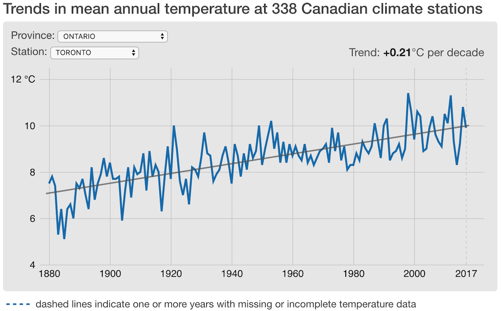

canada-clim
===========

A web app to visualize long-term trends in mean annual temperature at 338 Canadian climate stations. Available at <https://patrickbarks.github.io/canada-clim/>

**Data citation**: Vincent, L. A., X. L. Wang, E. J. Milewska, H. Wan, F. Yang, and V. Swail (2012) A second generation of homogenized Canadian monthly surface air temperature for climate trend analysis. Journal of Geophysical Research 117(D18110). <https://doi.org/10.1029/2012JD017859>
